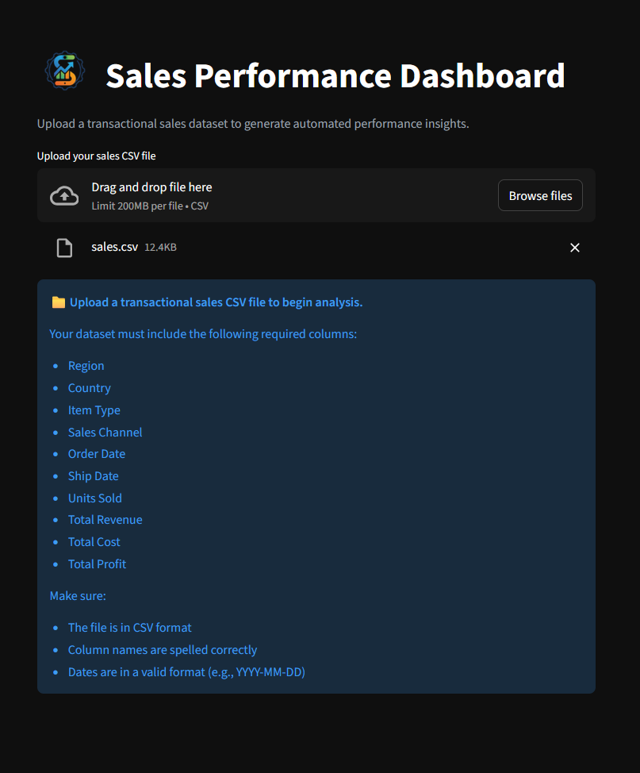
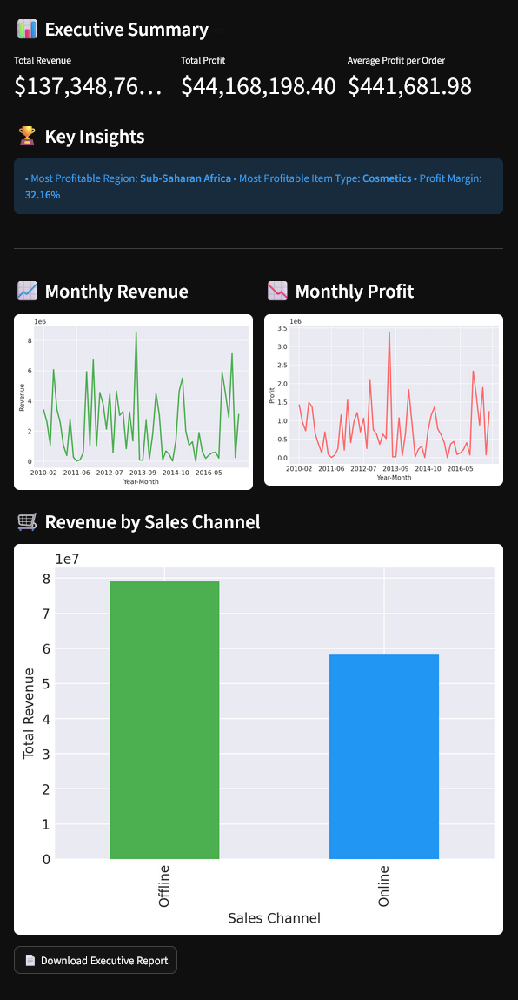

# 📊 Sales Performance Analytics Dashboard

A branded, production-ready analytics dashboard built using **Streamlit** that allows non-technical users to upload transactional sales data and instantly generate executive insights, KPIs, and visual reports.

This project demonstrates the transition from a simple data analysis script to a user-focused analytics product.

---

## 🌐 Live Demo

(Insert your deployed Streamlit link here)

---

## 🚀 Project Overview

This dashboard enables users to:

- Upload their own transactional sales CSV
- Automatically validate dataset structure
- Generate executive-level business insights
- Visualize revenue and profit trends
- Download an executive summary report

The goal was to combine **data processing, validation, presentation, and product-level UI design** into a single deployable analytics tool.

---

## ✨ Key Features

### 📁 File Upload Capability
Users can upload their own sales dataset in CSV format.

### 🧹 Robust Data Validation
The app validates:

- Required columns
- Date formats
- Numeric fields
- File integrity

Clear, user-friendly error messages are shown instead of Python tracebacks.

### 📊 Executive Summary
Automatically computes:

- Total Revenue
- Total Profit
- Average Profit per Order
- Profit Margin
- Most Profitable Region
- Most Profitable Item Type

### 📈 Visual Analytics

Includes:

- Monthly Revenue Trend
- Monthly Profit Trend
- Revenue by Sales Channel
- Clean YouTube-style dark UI theme

### 📄 Downloadable Report
Users can download a generated executive summary as a `.txt` report.

### 🎨 Branded UI
- Custom logo
- YouTube-style dark theme
- Improved layout structure
- Professional SaaS-style header

---

## 🖼 Application Preview

### 🔹 Before Uploading Dataset

---

### 🔹 After Uploading Dataset

---

## 📂 Required Dataset Structure

The uploaded CSV must include the following columns:

- Region  
- Country  
- Item Type  
- Sales Channel  
- Order Date  
- Ship Date  
- Units Sold  
- Total Revenue  
- Total Cost  
- Total Profit  

The app performs case-insensitive column validation.

---

## 🗂 Project Structure
sales-performance-analytics/
│
├── app.py
├── logo.png
├── requirements.txt
├── README.md
└── .streamlit/
└── config.toml

---

## 🛠 Technologies Used

- Python
- Streamlit
- Pandas
- Matplotlib
- Custom Streamlit theme configuration

---

## 🎯 Engineering Highlights

- Safe file ingestion using in-memory buffers
- Case-insensitive schema validation
- Robust numeric conversion handling
- Graceful error stopping using `st.stop()`
- Clean Git version control workflow
- Cloud deployment via Streamlit Community Cloud

---

## 🔮 Future Improvements

- Add forecasting module (time series projection)
- Add user-controlled filters (date, region, product)
- Switch to Plotly for interactive visualizations
- Add downloadable PDF executive report
- Add sample template download button
- Add multi-dataset comparison

---

## ▶️ Run Locally

1. Clone the repository:
git clone https://github.com/YOUR_USERNAME/sales-performance-analytics.git

2. Navigate into the project folder:

cd sales-performance-analytics

3. Install dependencies:

pip install -r requirements.txt

4. Run the application:

streamlit run app.py

---

## 💼 Portfolio Note

This project demonstrates:

- Data validation & ingestion design
- KPI computation logic
- Executive-level reporting
- UI/UX refinement
- Deployment workflow
- Git recovery & version control handling

It reflects a shift from pure analysis to product-oriented engineering.

---